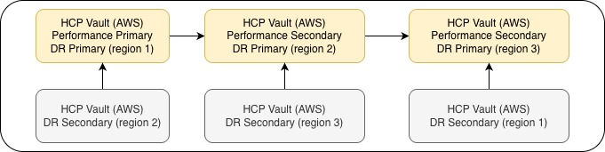
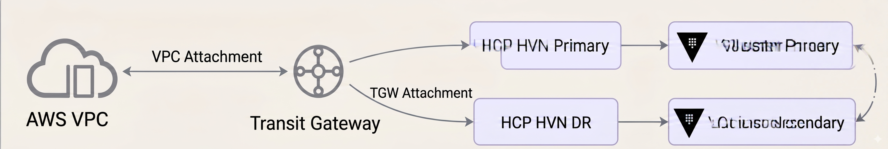

# HCP Vault Demo (AWS)

This demo creates the topology shown in your diagram using two Terraform stacks:

- `terraform/aws`
- `terraform/hcp-vault-aws/vault-cluster`

The implementation is based on the structure and patterns in `vault-hcp-dedicated-migration/terraform/aws` and `vault-hcp-dedicated-migration/terraform/hcp-vault-aws`.

## Topology

Vault cluster architecture:



Transit gateway architecture:



## Region Mapping

| System | Region Group | Platform Region | HCP Region |
|---|---|---|---|
| AWS | Group 1 | eu-west-1 (Ireland) | eu-west-1 (Ireland) |
| AWS | Group 2 | us-east-1 (N. Virginia) | us-east-1 (N. Virginia) |
| AWS | Group 3 | ap-southeast-1 (Singapore) | ap-southeast-1 (Singapore) |
| Azure | Group 1 | east-us | westeurope |
| Azure | Group 2 | central-India | eastus |
| Azure | Group 3 | west-us | southeastasia |

### `terraform/aws`

- AWS VPC, subnets, route tables, and internet gateway
- Optional acceptance of HCP peering requests
- Routes from AWS route tables to all HVN CIDRs in this topology

### `terraform/hcp-vault-aws/vault-cluster`

- Three primary HVNs and three primary Vault clusters (regions 1, 2, and 3)
- Performance replication chain: region 1 -> region 2 -> region 3
- DR-secondary HVN in region 2 for region 1
- DR-secondary HVN in region 3 for region 2
- DR-secondary HVN in region 1 for region 3
- HCP-to-AWS peering requests for all HVNs
- HVN routes from each HVN back to its matching AWS regional VPC

## Folder Layout

- `terraform/aws/main.tf`
- `terraform/aws/variables.tf`
- `terraform/aws/outputs.tf`
- `terraform/aws/versions.tf`
- `terraform/aws/data.tf`
- `terraform/aws/terraform.tfvars.example`
- `terraform/hcp-vault-aws/vault-cluster/main.tf`
- `terraform/hcp-vault-aws/vault-cluster/variables.tf`
- `terraform/hcp-vault-aws/vault-cluster/outputs.tf`
- `terraform/hcp-vault-aws/vault-cluster/versions.tf`
- `terraform/hcp-vault-aws/vault-cluster/terraform.tfvars.example`

## Prerequisites

1. Make a copy of `.env.example` and populate your AWS values.
2. Login into HCP.
3. Create a project, for example `hcp-vault-aws-prod`.
4. Get the `hcp-project-id` and populate your `.env` file.
5. Create a service account with admin access to the project.
6. Add `HCP_CLIENT_ID` and `HCP_CLIENT_SECRET` to your `.env` file.

Before running Terraform commands, source the environment file:

```bash
source .env
```

Create working `terraform.tfvars` files (not examples) in both stack directories:

```bash
cp terraform/aws/terraform.tfvars.example terraform/aws/terraform.tfvars
cp terraform/hcp-vault-aws/vault-cluster/terraform.tfvars.example terraform/hcp-vault-aws/vault-cluster/terraform.tfvars
```

## Deployment Order

1. Create the Terraform state S3 bucket (run once per environment).
2. Deploy AWS network stack.
3. Deploy HCP Vault stack.
4. Accept pending peering connections in AWS (if not auto-accepted).
5. Re-run AWS apply to ensure routes are final.

## Commands

```bash
# 1) Load environment variables
source .env

# 2) One-time setup: create Terraform state bucket (run once)
./scripts/create_s3_bucket.sh <globally-unique-bucket-name> <region>

# 3) Create tfvars copies
cp terraform/aws/terraform.tfvars.example terraform/aws/terraform.tfvars
cp terraform/hcp-vault-aws/vault-cluster/terraform.tfvars.example terraform/hcp-vault-aws/vault-cluster/terraform.tfvars

# 4) AWS network
terraform -chdir=terraform/aws init
terraform -chdir=terraform/aws plan
terraform -chdir=terraform/aws apply

# 5) HCP Vault on AWS
terraform -chdir=terraform/hcp-vault-aws/vault-cluster init
terraform -chdir=terraform/hcp-vault-aws/vault-cluster plan
terraform -chdir=terraform/hcp-vault-aws/vault-cluster apply

# 6) Re-run AWS for final routes after peering acceptance
terraform -chdir=terraform/aws apply
```

## GitHub Actions (On-Demand)

Two separate manual workflows are included:

- `.github/workflows/deploy-aws.yml`
- `.github/workflows/deploy-hcp-vault-cluster.yml`

These workflows run only when manually triggered (`workflow_dispatch`) from the GitHub Actions tab.

Required repository secrets:

- `AWS_ACCESS_KEY_ID`
- `AWS_SECRET_ACCESS_KEY`
- `AWS_REGION`
- `HCP_CLIENT_ID`
- `HCP_CLIENT_SECRET`
- `HCP_PROJECT_ID`

How to run:

1. Open **GitHub -> Actions**.
2. Select either **Deploy AWS** or **Deploy HCP Vault Cluster**.
3. Click **Run workflow**.
4. Set `apply` to `false` to run plan only.
5. Set `apply` to `true` to run plan and apply.

## Manual DR Cluster Setup (HCP Console)

After Terraform is complete, create DR clusters manually in the HCP console.

Guidance:
https://developer.hashicorp.com/vault/tutorials/get-started-hcp-vault-dedicated/manage-clusters#create-cluster-with-cross-region-dr

Select the backup network (HVN) as follows:

| Primary Cluster | Primary Region | Backup Network (HVN) | Backup Region |
|---|---|---|---|
| `vault-r1-primary` | eu-west-1 | `vault-r2-dr-for-r1-hvn` | us-east-1 |
| `vault-r2-primary` | us-east-1 | `vault-r3-dr-for-r2-hvn` | ap-southeast-1 |
| `vault-r3-primary` | ap-southeast-1 | `vault-r1-dr-for-r3-hvn` | eu-west-1 |

## Required Environment Variables

- `AWS_ACCESS_KEY_ID`
- `AWS_SECRET_ACCESS_KEY`
- `AWS_REGION`
- `HCP_CLIENT_ID`
- `HCP_CLIENT_SECRET`

Optional for HCP Vault provider operations outside this scaffold:

- `VAULT_ADDR`
- `VAULT_TOKEN`