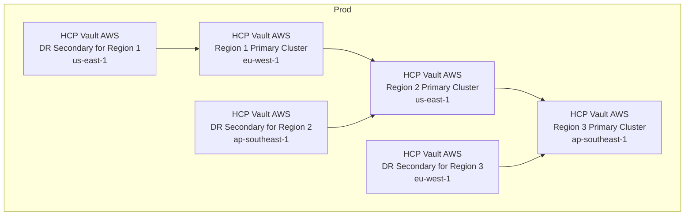

# HCP Vault Demo (AWS)

This demo creates the topology shown in your diagram using two Terraform stacks:

- `terraform/aws`
- `terraform/hcp-vault-aws`

The implementation is based on the structure and patterns in `vault-hcp-dedicated-migration/terraform/aws` and `vault-hcp-dedicated-migration/terraform/hcp-vault-aws`.

## Topology Diagram



## Region Mapping

| System | Region Group | Platform Region | HCP Region |
|---|---|---|---|
| AWS | Group 1 | eu-west-1 (Ireland) | eu-west-1 (Ireland) |
| AWS | Group 2 | us-east-1 (N. Virginia) | us-east-1 (N. Virginia) |
| AWS | Group 3 | ap-southeast-1 (Singapore) | ap-southeast-1 (Singapore) |
| Azure | Group 1 | east-us | westeurope |
| Azure | Group 2 | central-India | eastus |
| Azure | Group 3 | west-us | southeastasia |

### `terraform/aws`

- AWS VPC, subnets, route tables, and internet gateway
- Optional acceptance of HCP peering requests
- Routes from AWS route tables to all HVN CIDRs in this topology

### `terraform/hcp-vault-aws`

- Three primary HVNs and three primary Vault clusters (regions 1, 2, and 3)
- Performance replication chain: region 1 -> region 2 -> region 3
- DR-secondary HVN in region 2 for region 1
- DR-secondary HVN in region 3 for region 2
- DR-secondary HVN in region 1 for region 3
- HCP-to-AWS peering requests for all HVNs
- HVN routes from each HVN back to its matching AWS regional VPC

## Folder Layout

- `terraform/aws/main.tf`
- `terraform/aws/variables.tf`
- `terraform/aws/outputs.tf`
- `terraform/aws/versions.tf`
- `terraform/aws/data.tf`
- `terraform/aws/terraform.tfvars.example`
- `terraform/hcp-vault-aws/main.tf`
- `terraform/hcp-vault-aws/variables.tf`
- `terraform/hcp-vault-aws/outputs.tf`
- `terraform/hcp-vault-aws/versions.tf`
- `terraform/hcp-vault-aws/terraform.tfvars.example`

## Deployment Order

1. Deploy AWS network stack.
2. Deploy HCP Vault stack.
3. Accept pending peering connections in AWS (if not auto-accepted).
4. Re-run AWS apply to ensure routes are final.

## Commands

```bash
# 1) AWS network
terraform -chdir=terraform/aws init
cp terraform/aws/terraform.tfvars.example terraform/aws/terraform.tfvars
terraform -chdir=terraform/aws plan
terraform -chdir=terraform/aws apply

# 2) HCP Vault on AWS
terraform -chdir=terraform/hcp-vault-aws init
cp terraform/hcp-vault-aws/terraform.tfvars.example terraform/hcp-vault-aws/terraform.tfvars
terraform -chdir=terraform/hcp-vault-aws plan
terraform -chdir=terraform/hcp-vault-aws apply

# 3) Re-run AWS for final routes after peering acceptance
terraform -chdir=terraform/aws apply
```

## Required Environment Variables

- `AWS_ACCESS_KEY_ID`
- `AWS_SECRET_ACCESS_KEY`
- `AWS_REGION`
- `HCP_CLIENT_ID`
- `HCP_CLIENT_SECRET`

Optional for HCP Vault provider operations outside this scaffold:

- `VAULT_ADDR`
- `VAULT_TOKEN`