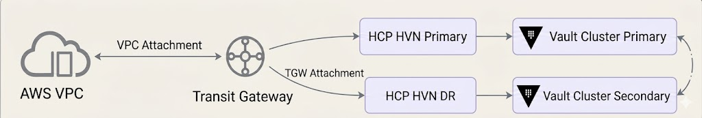
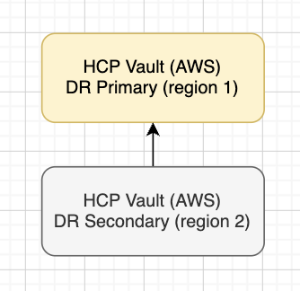

# HCP Vault Demo (AWS)

This demo creates the topology shown in your diagram using two Terraform stacks:

- `terraform/aws`
- `terraform/hcp-vault-aws/vault-cluster`

The implementation is based on the structure and patterns in `vault-hcp-dedicated-migration/terraform/aws` and `vault-hcp-dedicated-migration/terraform/hcp-vault-aws`.

## Topology

Vault cluster architecture (Prod AWS):


Transit gateway architecture:



Non-prod architecture:




## Region Mapping

| System | Region Group | Platform Region | HCP Region |
|---|---|---|---|
| AWS | Group 1 | eu-west-1 (Ireland) | eu-west-1 (Ireland) |
| AWS | Group 2 | us-east-1 (N. Virginia) | us-east-1 (N. Virginia) |
| AWS | Group 3 | ap-southeast-1 (Singapore) | ap-southeast-1 (Singapore) |
| Azure | Group 1 | east-us | westeurope |
| Azure | Group 2 | central-India | eastus |
| Azure | Group 3 | west-us | southeastasia |

### `terraform/aws`

- AWS VPC, subnets, route tables, and internet gateway
- One AWS Transit Gateway per region
- VPC attachments for each regional VPC
- RAM shares for each regional Transit Gateway
- Optional acceptance of HCP Transit Gateway attachment requests
- Routes from AWS route tables to all HVN CIDRs via Transit Gateway

### `terraform/hcp-vault-aws/vault-cluster`

- Scenario-based deployment via `topology_scenario` with two architecture profiles:
- `prod`: creates Vault clusters for `cluster_1` (primary), `cluster_2` and `cluster_3` (secondary performance replicas to cluster_1). For `cluster_4`..`cluster_6`, Terraform creates HVNs only; Vault clusters are manual.
- `non-prod`: creates `cluster_1` as the only Terraform-managed Vault cluster. The DR secondary (`cluster_2`) is created manually in HCP.
- Optional HVN peering controlled by `enable_hvn_peering` (default `true`)
- When `enable_hvn_peering = true`, HCP Transit Gateway attachments are created for active HVNs in the selected scenario
- When `enable_hvn_peering = true`, HVN routes are created from active HVNs back to matching AWS regional VPCs via Transit Gateway
- `cluster_configs` is required and must be defined in environment tfvars.
- `aws_region_connectivity` is required only when `enable_hvn_peering = true`.

## Folder Layout

- `terraform/aws/main.tf`
- `terraform/aws/variables.tf`
- `terraform/aws/outputs.tf`
- `terraform/aws/versions.tf`
- `terraform/aws/data.tf`
- `terraform/aws/terraform.tfvars.example`
- `terraform/hcp-vault-aws/vault-cluster/main.tf`
- `terraform/hcp-vault-aws/vault-cluster/variables.tf`
- `terraform/hcp-vault-aws/vault-cluster/outputs.tf`
- `terraform/hcp-vault-aws/vault-cluster/versions.tf`
- `terraform/hcp-vault-aws/vault-cluster/terraform.tfvars.example`

## Prerequisites

1. Make a copy of `.env.example` and populate your AWS values.
2. Login into HCP.
3. Create a project, for example `hcp-vault-aws-prod`.
4. Get the `hcp-project-id` and populate your `.env` file.
5. Create a service account with admin access to the project.
6. Add `HCP_CLIENT_ID` and `HCP_CLIENT_SECRET` to your `.env` file.

Before running Terraform commands, source the environment file:

```bash
source .env
```

Create workspace-specific tfvars files in both stack directories:

```bash
cp terraform/aws/terraform.tfvars.example terraform/aws/non-prod.tfvars
cp terraform/aws/terraform.tfvars.example terraform/aws/prod.tfvars

cp terraform/hcp-vault-aws/vault-cluster/terraform.tfvars.example terraform/hcp-vault-aws/vault-cluster/non-prod.tfvars
cp terraform/hcp-vault-aws/vault-cluster/terraform.tfvars.example terraform/hcp-vault-aws/vault-cluster/prod.tfvars
```

Set different HCP project IDs per environment:

- `terraform/hcp-vault-aws/vault-cluster/non-prod.tfvars` -> non-prod HCP project ID
- `terraform/hcp-vault-aws/vault-cluster/prod.tfvars` -> prod HCP project ID

Example:

```hcl
# non-prod.tfvars
project_id = "<hcp-non-prod-project-id>"
topology_scenario = "non-prod"

# prod.tfvars
project_id = "<hcp-prod-project-id>"
topology_scenario = "prod"
# Prod uses cluster_1..cluster_6 for HVN/network mapping; Terraform creates Vault clusters for cluster_1..cluster_3.
```

## Deployment Order

1. Create the Terraform state S3 bucket (run once per environment).
2. Create/select Terraform workspace (`non-prod` or `prod`) in both stacks.
3. Deploy AWS network + Transit Gateways + RAM shares using workspace tfvars.
4. Set HCP provider AWS account IDs in workspace tfvars and re-apply AWS.
5. If `enable_hvn_peering = true`, populate `aws_region_connectivity` in `terraform/hcp-vault-aws/vault-cluster/<workspace>.tfvars` from AWS outputs (TGW IDs, TGW share ARNs, VPC CIDRs).
6. Deploy HCP Vault stack using the matching workspace tfvars (with matching HCP project ID).
7. Accept pending Transit Gateway attachments in AWS (if not auto-accepted).
8. Enable `enable_hcp_tgw_acceptance = true` in AWS workspace tfvars and apply AWS.
9. Re-run plans for both stacks and confirm no changes.

## Commands

```bash
# 1) Load environment variables
source .env

# 2) One-time setup: create Terraform state bucket (run once)
./scripts/create_s3_bucket.sh <globally-unique-bucket-name> <region>

# 3) Create workspace tfvars
cp terraform/aws/terraform.tfvars.example terraform/aws/non-prod.tfvars
cp terraform/aws/terraform.tfvars.example terraform/aws/prod.tfvars
cp terraform/hcp-vault-aws/vault-cluster/terraform.tfvars.example terraform/hcp-vault-aws/vault-cluster/non-prod.tfvars
cp terraform/hcp-vault-aws/vault-cluster/terraform.tfvars.example terraform/hcp-vault-aws/vault-cluster/prod.tfvars

# 4) Choose environment
export TF_ENV=non-prod   # or prod

# 5) AWS stack: init + workspace
terraform -chdir=terraform/aws init -reconfigure
terraform -chdir=terraform/aws workspace new "$TF_ENV" || terraform -chdir=terraform/aws workspace select "$TF_ENV"
terraform -chdir=terraform/aws workspace show

# 6) AWS network apply with workspace tfvars
terraform -chdir=terraform/aws plan  -var-file="$TF_ENV.tfvars"
terraform -chdir=terraform/aws apply -var-file="$TF_ENV.tfvars"

# 7) Set HCP provider account IDs in terraform/aws/$TF_ENV.tfvars
# Example (same account ID may be used across all regions):
# hcp_provider_account_id_region_1 = "<hcp-provider-account-id>"
# hcp_provider_account_id_region_2 = "<hcp-provider-account-id>"
# hcp_provider_account_id_region_3 = "<hcp-provider-account-id>"
# hcp_provider_account_id_region_4 = "<hcp-provider-account-id>"
# hcp_provider_account_id_region_5 = "<hcp-provider-account-id>"
# hcp_provider_account_id_region_6 = "<hcp-provider-account-id>"

# 8) Re-apply AWS to create RAM principal associations
terraform -chdir=terraform/aws apply -var-file="$TF_ENV.tfvars"

# 9) If enable_hvn_peering=true, capture AWS outputs and populate aws_region_connectivity in
#    terraform/hcp-vault-aws/vault-cluster/$TF_ENV.tfvars for each active cluster key.
#    Example key structure:
#    aws_region_connectivity = {
#      cluster_1 = {
#        transit_gateway_id = "<tgw-id>"
#        resource_share_arn = "<tgw-share-arn>"
#        destination_cidr   = "<aws-vpc-cidr>"
#      }
#    }
terraform -chdir=terraform/aws output tgw_region_1_id
terraform -chdir=terraform/aws output tgw_region_2_id
terraform -chdir=terraform/aws output tgw_region_3_id
terraform -chdir=terraform/aws output tgw_region_1_share_arn
terraform -chdir=terraform/aws output tgw_region_2_share_arn
terraform -chdir=terraform/aws output tgw_region_3_share_arn
terraform -chdir=terraform/aws output vpc_region_1_cidr_block
terraform -chdir=terraform/aws output vpc_region_2_cidr_block
terraform -chdir=terraform/aws output vpc_region_3_cidr_block

# 10) HCP stack: init + same workspace
terraform -chdir=terraform/hcp-vault-aws/vault-cluster init -reconfigure
terraform -chdir=terraform/hcp-vault-aws/vault-cluster workspace new "$TF_ENV" || terraform -chdir=terraform/hcp-vault-aws/vault-cluster workspace select "$TF_ENV"
terraform -chdir=terraform/hcp-vault-aws/vault-cluster workspace show

# 11) HCP Vault on AWS using matching workspace tfvars
terraform -chdir=terraform/hcp-vault-aws/vault-cluster plan  -var-file="$TF_ENV.tfvars"
terraform -chdir=terraform/hcp-vault-aws/vault-cluster apply -var-file="$TF_ENV.tfvars"

# 12) Accept pending Transit Gateway attachments in AWS Console if needed
# VPC/EC2 -> Transit Gateways -> Transit Gateway Attachments -> Accept

# 13) Enable acceptance in terraform/aws/$TF_ENV.tfvars and apply:
# enable_hcp_tgw_acceptance = true
terraform -chdir=terraform/aws apply -var-file="$TF_ENV.tfvars"

# 14) Final convergence check (same workspace)
terraform -chdir=terraform/aws plan -var-file="$TF_ENV.tfvars"
terraform -chdir=terraform/hcp-vault-aws/vault-cluster plan -var-file="$TF_ENV.tfvars"
```

Important workspace notes:

- Do not use the `default` workspace for environment deployments.
- Use the same workspace name in both stacks (`non-prod` with `non-prod`, `prod` with `prod`).
- Backends are configured with workspace-isolated S3 paths via `workspace_key_prefix`.

## Transit Gateway Notes

- Transit Gateway is regional; create one TGW per AWS region you plan to map in `aws_region_connectivity`.
- In `prod`, configure connectivity entries for all active cluster keys (`cluster_1`..`cluster_6`) when peering is enabled.
- In `non-prod`, configure connectivity entries for `cluster_1` and `cluster_2` when peering is enabled.
- If HCP apply returns `resource share doesn't exist in the cloud provider`, ensure
	`hcp_provider_account_id_region_1..6` are set in `terraform/aws/<workspace>.tfvars`
	and AWS stack has been re-applied to create RAM principal associations.

## GitHub Actions (On-Demand)

Two separate manual workflows are included:

- `.github/workflows/deploy-aws.yml`
- `.github/workflows/deploy-hcp-vault-cluster.yml`

These workflows run only when manually triggered (`workflow_dispatch`) from the GitHub Actions tab.

Required repository secrets:

- `AWS_ACCESS_KEY_ID`
- `AWS_SECRET_ACCESS_KEY`
- `AWS_REGION`
- `HCP_CLIENT_ID`
- `HCP_CLIENT_SECRET`

Workflow behavior:

- Both workflows require a `workspace` input (`non-prod` by default, or `prod`).
- Both workflows select the provided workspace and run with `-var-file=<workspace>.tfvars`.

Make sure these files exist and are populated for the workspace you select:

- `terraform/aws/non-prod.tfvars` and `terraform/hcp-vault-aws/vault-cluster/non-prod.tfvars`
- `terraform/aws/prod.tfvars` and `terraform/hcp-vault-aws/vault-cluster/prod.tfvars`

How to run:

1. Open **GitHub -> Actions**.
2. Select either **Deploy AWS** or **Deploy HCP Vault Cluster**.
3. Click **Run workflow**.
4. Choose `workspace` (`non-prod` or `prod`).
5. Set `apply` to `false` to run plan only.
6. Set `apply` to `true` to run plan and apply.

## Manual DR Cluster Setup (HCP Console)

DR clusters are created only after the HVN and connectivity has been completed.

Edit the existing Vault cluster and create a backup network selecting the DR HVN. 

Guidance:
https://developer.hashicorp.com/vault/tutorials/get-started-hcp-vault-dedicated/manage-clusters#create-cluster-with-cross-region-dr

## Required Environment Variables

- `AWS_ACCESS_KEY_ID`
- `AWS_SECRET_ACCESS_KEY`
- `AWS_REGION`
- `HCP_CLIENT_ID`
- `HCP_CLIENT_SECRET`

Optional for HCP Vault provider operations outside this scaffold:

- `VAULT_ADDR`
- `VAULT_TOKEN`